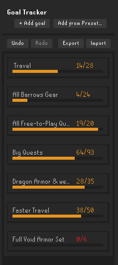
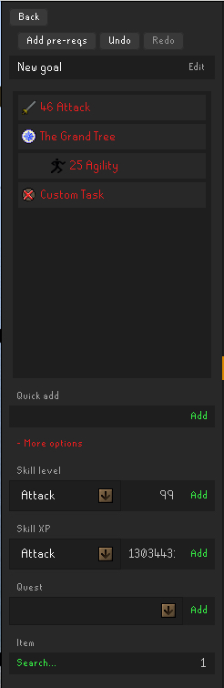
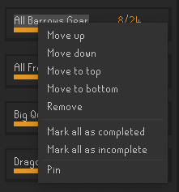
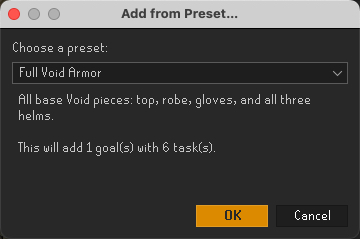
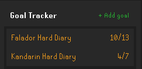
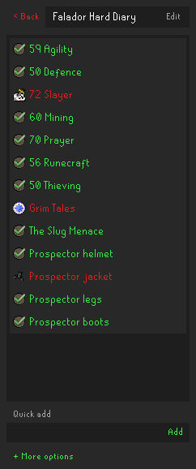
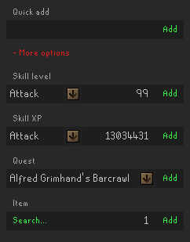

# 🏆 Goal Tracker

> A reimagining of the Goal Tracker plugin — rebuilt with a more modern UI, powerful new features, and improved stability to help you plan, track, and achieve your Old School RuneScape goals with ease.  
> It is now faster, cleaner, and more reliable — introducing a Quest Requirements system, presets, improved visuals, and smoother task/goal management.

---

✨ New Features
- Shift+Click task removal for faster management
- Automatic goal status checks for real-time progress
- ActionBar & ActionBarButton UI components for navigation and bulk actions
- Progress bars added under each goal card on the Home panel for quick visual tracking
- Quest Requirements file built and integrated for quick access to quest prerequisites
- Preset Goal Lists
- Export/Import goals to JSON with full UI refresh
- Inline editing for goal titles and manual tasks
- Long titles now ellipsized with hover-to-view full text

♻️ Redesigned
- Quest prerequisites button leveraging the new Quest Requirements file
- Cascading completion to auto-complete related tasks
- Dropdown quest selector for faster task addition
- Right-click menus streamlined for prerequisites and child task options
- Goal/task cards with lighter fills, shadows, hover/press effects, and clear header dividers

🐛 Fixes
- Undo/Redo functionality cleanup
- ActionBarButton painting glitches resolved
- Proper refresh handling in GoalTrackerPanel and ListPanel
- Fixed blank/refresh issues when switching panels or logging in
- Item icons preload correctly at startup/login/import
- Home panel refreshes immediately after task completion
- Layout fixes around Export button to avoid overlap
- Recursive refresh of child tasks ensures status consistency

### 🖼️ Screenshots

- **Home panel with goal cards** — redesigned buttons with hover/press effects, new progress bars under each goal card, plus the “Add from Preset” button and Export/Import to JSON buttons for easy sharing.  
  

- **Inside a goal with task list** — supports auto-fill quest prerequisites, right-click task options, a new item search box, and a dropdown quest selector.  
  

- **Right‑click menu on a Home panel goal card** — manage goals quickly with options to move, pin, mark complete/incomplete, or delete.  
  

- **Add from preset** — includes built-in support for Barrows gear, Void armor sets, and basic Ironman progression presets.  
  

-----

<h3 style="display:inline;">📜 Original Goal Tracker v1 Readme & Documentation (created by dillydill123)</h3>

# Runelite Goal Tracker Plugin

Keep track of your OSRS goals and complete them automatically.

## Features

- Track different types of tasks
    - Manual tasks
    - Skill tasks
    - Quests
    - Item tasks
- Organise tasks lists into goals
- Reorder and manage goal and task lists
- Chat notification on task completion

### Planned

- More task types
    - Achievement diaries
    - Minigame rewards
    - Kourend favour
    - NPC kills

Suggestions are welcome - please submit an issue :)

## Usage

### Goals

Goals are lists of tasks, and at a glance provide a quick way to view your progress towards the goal.

You can add a new goal with the "+ Add goal" button, and you can reorder/remove goals using right click. Clicking a goal will show the tasks within:

From here, you can add tasks to the goal.

### Adding tasks

#### Manual tasks

Basically a simple to-do list item. You can add these via the "Quick add" text box.

You can toggle them on and off manually just by clicking them.

Use the "+ More options" button to reveal the automatic task options.

#### Skill level/XP tasks

Use these tasks to automatically track skill progress. Just select a skill, and the desired level or XP amount. The task will automatically complete once you hit that level/xp.

#### Quest tasks

Track quest progress and completion, just select a quest or miniquest from the dropdown. Will also display in progress quests as orange.

#### Item tasks

Select an item using the search button and searching via the in-game chatbox, then set the desired quantity. The plugin will keep track of your items and tally up quantities stored in different inventories (bank, player, GIMP storage), and will be automatically completed once you get that amount of the item.

